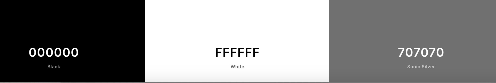

Paul John Group - Website
---

## Table of Contents

- [**About**](#About)
- [**UX**](#UX)
  - [Goals](#Goals)
  - [User Stories](#User-Stories)
  - [Styling](#Styling)
  - [Wireframes](#Wireframes)
- [**Features**](#Features)
  - [Existing Features](#Existing-Features)
  - [Features Left To Implement](#Features-Left-To-Implement)
- [**Technologies Used**](#Technologies-Used)
  - [Version Control](#Version-Control)
- [**Testing**](#Testing)
  - [Testing User Stories](#Testing-User-Stories)
  - [Responsive Testing](#Responsive-Testing)
  - [Additional Testing](#Additional-Testing)
  - [Code Validation](#Code-Validation)
- [**Deployment**](#Deployment)
  - [Live Website Link](#Live-App-Link)
  - [Repository Link](#Repository-Link)
  - [Running Code Locally](#Running-Code-Locally)
- [**Credits**](#Credits)
  - [Content](#Content)
  - [Media](#Media)
  - [Acknowledgements](#Acknowledgements)
  
---

## About

This website was reveloped for Paul John Group to show the excellent work, each company in the group does in various different sectors in the Construction Industry. 

The original site was created using a drag and drop web site developement tool online. This meant it wasn't responsive on mobiles, tablets and different media.

My mission was to re-design the site using HTML, CSS and Bootstrap to increase the companies presence online and give a more professional look when viewing on all devices.

___

## UX

#### Goals

The Goals of the website is to:-
1. Attract new clients to use Paul John Group for all there construction needs by showing current work on the website via Video, Pictures and Case Studies.
2. Attract new employees to work for Paul John Group by viewing the website. This will attract better quality employees when they see the standards on Paul Johns work on the website.
3. To work on all devices from PC's and Laptops to Tablets and Mobile phones.

---

#### User Stories

From Paul Johns Perspective:-

- The site needs to be easy to navigate to find the relevant information.
- The site needs to have a easy to view colour scheme for easy viewing.
- The pictures on the website need to be clear and easy to view so users can easily see the detail on all devices.
- The video needs to be a highlight of the website at the beginning so users can see and view the video straight away. If required afterwards, they can browse the website for further information.
- New contracts awarded need to be communicated on the site so users accessing the site can see the company is winning new contracts all the time. This will encorage users in the construction industry to apply for jobs with Paul John.
- Case Studies with clear pictures and detailed information need to be easy to find.
- The contact us page needs to be easy to find and use. This will encourage new clients and new employees if they can find this easy.
- The Health and Safety information and Accreditations needs to be easy to view and on the front page. Health and Safety is a big part of the business.
- The different companies in the group needs to be displayed on the site and easy to find.
- The different areas for each company need to be displayed on the site and easy to find.
- Social Media needs to be advertised on the website.

From the Users (Client) in the construction industries perspective:-

There is so many Civil Engineering companies to use, the website needs to make Paul John stand out from the rest.

- I want to see what jobs the company have worked on and pictures of the quality of work.
- I want to find information quickly like pictures and videos
- I want to see history of the company so I can be confident using this company for my construction needs.
- I want to be able to contact for company easily if i have any work available.
- I want to feel confident when looking at the website that Paul John Group are a professional outfit to use.

From the users (Employee) in the construction industries perspective:-

- I need to find the contact details easily so i can apply for a job.
- I want to see what kind of work the company does to see if I have the correct skill set to work for this company.
- I want to see the company is winning contracts so if I apply for a job for this company, I know my job would be secure.
- I need to see the companies health and safety is good so if I apply for a job i know i'm going to be safe.

---

### Styling

The website needed to be clear and concise and easy to view. The company logo for Paul John uses shades of red, yellow, grey, white and black. Colours from the logo were used but Yellow and Red were ignored due to the brightness of the colours.

I used the the below colours for the body, site sections, headers and footers, navigation and social media links.

The fonts chose were also based on the font used in the company logo, a nice rounded, easy to read font was used. the selections from google fonts were:-

- Muli with Sans-Serif as a backup.

---

### Wireframes

Wireframes were created using software called Pencil on Macbook.

Please see the links to the wireframes below.

Home - Main Browser - [MainBrowserHome](Documentation/Wireframes/Home-MainBrowser.pdf)
Home - Tablet - [TabletHome](Documentation/Wireframes/Home-Tablet.pdf)
Home - Mobile - [MobileHome](Documentation/Wireframes/Home-Mobile.pdf)

Case Studies - Main Browser - [MainBrowserCaseStudies](Documentation/Wireframes/CaseStudies-MainBrowser.pdf)
Case Studies - Tablet - [TabletCaseStudies](Documentation/Wireframes/CaseStudies-Tablet.pdf)
Case Studies - Mobile - [MobileCaseStudies](Documentation/Wireframes/CaseStudies-Mobile.pdf)

News - Main Browser - [MainBrowserNews](Documentation/Wireframes/News-MainBrowser.pdf)
News - Tablet - [TabletNews](Documentation/Wireframes/News-Tablet.pdf)
News - Mobile - [MobileNews](Documentation/Wireframes/News-Mobile.pdf)

Contact Us - Main Browser - [MainBrowserContactUs](Documentation/Wireframes/ContactUs-MainBrowser.pdf)
Contact Us - Tablet - [TabletContactUs](Documentation/Wireframes/ContactUs-Tablet.pdf)
Contact Us - Mobile - [MobileContactUs](Documentation/Wireframes/ContactUs-Mobile.pdf)

**Design Changes to Wireframes**

1. Case Studies - Tablet -  Images are two rows of two images with the text below rather than at the side like on the wireframe.
2. Case Studies - Mobile - Images stack on top of each other one by one rather than two and two.

---

## Features

### Existing Features

- The websites navigation menu is pinned to the top of the screen on all devices, this allows the user to easily change between different pages.
- The navigation options are grey but the page the user is on is always shown in white.
- The Paul John Group logo always takes the user back to the home page.
- The website shows a brief history of the company and a video to advertise the company. This is the main part of the home page.
- The website breaks the different sections on each page by a Black Background and white writing and a white background with black writing. This is to show its a different section on the page to the user.
- The Google Maps frame is always shown in the footer to show the location of the head office for Paul John Group.
- Social Media links are always shown in the footer in grey and change to white when selected.
- Latest Case Studies are shown on the site with high quality pictures so users of the site can easily see and find information about jobs that have been completed.
- Latest News announcements are shown on the website to keep users of the website informed about what the company is doing.
- The Contact Us page is a simple easy to understand form that can be filled in by the user to contact head office.

### Features Left To Implement

- An upload feature could be added to contact us so when people are applying to work for the company, a copy of their CV could be sent.
- Documentation could be added for download for users, things like Privacy Policys etc.
- A job vacancies board could be added to show the current jobs we have available.
- A secure login page for internal staff, so forms for site could be accessed through the site and filled in online rather than manually. These forms could then be uploaded via FTP to a secure folder location on the Paul John Server.

---

## Technologies Used

- Boostrap 4
  - Bootstrap 4 was used for setting up the sites responsiveness of different size devices using the grid system. It was also used to make the containers fluid and images so they change size automatically depending on the screen size.

- HTML  
  - HTML was used for the main structure of the website.

- CSS
  - CSS was used to style and change sizes and positions of different items where Bootstrap couldn't be used.

- Google Chrome
  - Google Chrome Inspect and Developer tools was used for examining the website on different devices.

- Google Fonts
  - Google fonts was used for the font of the website.

- Font Awesome
  - Font Awesome was used for the icons for social media - Instagram, Twitter and Linked In.

- VS Code 
  - VS Code was used as the development tool to create all pages. Different add-ons were used in VS Code to aid my developement. These add-ons included were:-
    - Auto Close and Rename Tag - to end tags automatically.
    - Beauty - To help Beautify my coding.
    - Color Highlight - Shows the colours in your coding.
    - CSS Peek - Allows you to show the CSS Next to your HTML Code, rather than going between the two files.
    - Live Server - Allows you to see the live webpage as you code
    - Markdown Preview Enhancer - Allows you to see your markdown file as you type.
    - Prettier - Allows you to Beautify your CSS.

- Pencil
  - This allowed me to create my wireframes for the design of the website.

### Version Control

- VS Code
  - VS Code linked to the repositry in Github was used to do regular Commits from my changes and additions to the website.

- Github
  - Github was used to store the repositry online. All Adds/Commits go to this file online. 

---

## Testing

### Testing User Stories

| Test  |  Result | Extra Coding Required  |
|---|---|---|
|  Site needs to be easy to navigate - Test scrolling through pages accessing pages from the menu |  All Page links and scrolling works correctly |  N/A |
|  Test the navigation menu sticks to the top when scrolling |  Navigation menu sticks to the top on all devices |  N/A |
| Colour Scheme needs to be easy to view  |  Tested all pages to make sure it was easy to see and view on all devices |   N/A|
|  Pictures need to be high quality and easy to view on all devices |   Test each picture on Laptop/ Tablet and phone to make sure they display correctly with quality| N/A  |
|  Video needs to be the hightlight of the home page | Tested video size on all devices to make sure it was clearly visible and at the top of the home page  |  N/A |
|  New Contracts need to be communicated |   Test the news page to make sure it was clearly visible on all devices|  N/A |
|  Contact US page needs to be easy to find and use | Tested the contact us pageon all devices to make sure it displays and is easy to understand  |  N/A |
| Health and Safety section needs to be displayed correctly with logos for accreditations  |  Accreditations didn't display properly on mobile- They looked too small |  Column and Row settings changed for 3 images per row in mobile |
|  Social Media Links | Tested all social media links displayed correctly and linked to the correct pages, also tested the hover function on all  | N/A  |

### Responsive Testing

To check how the website runned on different devices I used Am-I-Responsive and Inspect in Google Chrome Developer Tools. While doing these tests I did the following:-

|  Test | Result  |  Extra Coding Required |
|---|---|---|
|  Logo displays correctly on all devices |  Tested using Google Crome Developer Tools - Logo was too big on Mobile Device |  Added a media query to correct the issue |
| H1,H2 and H3s testing on home page  | They looked too close to the edge of the screen on all devices  |  More Padding added to the container and each header |
|  Text display on home page on all devices |  Under the group of companies, it over lapped |  Used a media query to correct the text size on smaller devices |

All pages were tested vigorously using google chrome developer tools. On each page I tested:-
  - Images
  - Navbar Links
  - Text
  - Headings
  - Containers
  - Footer Links

Testing was also done on my PC at work, Laptop at home, Macbook at home, ipad at home and iphone at home. This allowed to see how the website looks physically on the actual device rather than on a screen.

### Additional Testing

Additonal testing was also done on Firefox, Edge as well as Chrome. 

Other members of my household also tested my website on different devices so this gave me an alternate viewpoint.

Testing was also carried out after my post by users in the slack community. The following issues were found which will be fixed prior to the next release.
 - Content under What we do section on the home page wasn't completed setences, suggestion to have it has a underordered list instead
 - Welcome to Paul John Group on the H5 header needs some padding adding on desktop devices
 - On the case studies page, the bold writing needs to be made more prominent
 - Punctuation on the News Page needs to be corrected.
 - Contact Us Page needs some padding adding on smaller devices, it was too close to the edge of the mobile screen.
 - New Website Post on the news page needs the play button removing because it looks like a video and might confuse users to try and click it.
 - No Favicon.ico
 - Reason on the select form isn't required when submitting a contact form.

 ### Code Validation

 W3C Markup Validation Service and W3C CSS Validation Service was used for validating the code, the following errors were corrected from the validation services

 - Some Images had illegal names with spaces or illegal characters in, the relevant images were changed.
 - The Iframe for google maps failed because the styling was included direct in the HTML which was copied from Google Maps website. All styling  was removed from HTML and added to CSS to correct the issue.
 - Two lines in each header for each page were pointing to two different CSS Files. Multiple lines removed to correct the issue.

 Now all pages on the website are now validated.

 ---

## Deployment

### Live Website Link

 https://mattmoore050783.github.io/PaulJohnGroup-MS1/

 The website link was created by doing the following steps.

 1. Click on Settings which is located at the top of the page.
 2. Scroll down to the GitHub pages.
 3. Click the dropdown menu under source and select the Master Branch as the source
 4. Scroll through the page to find the site link.

### Repository Link

https://github.com/MattMoore050783/PaulJohnGroup-MS1

### Running Code Locally

To run this website and code on your local device, follow the below steps.

1. Go to repository PaulJohnGroup-MS1 on github.
2. Click Clone or Download.
3. Download the Zip File.
4. Unzip the downloaded zip file on the local device.
5. Run the index.html file via your web browser.

---

## Credits

### Content

All Code was written by myself, I used the following to help my coding.

- Code Institue CV Task/ project 
- https://www.w3schools.com/default.asp I used various parts from this website to help with any coding challenges I was facing.
- https://getbootstrap.com/docs/4.5/getting-started/introduction/ I used this website to give me extra tuition on bootstrap, especially the sections on grids and containers and images.
- https://stackoverflow.com/ I used this website for any coding challenges I was facing to get ideas to solve the issue.
https://vimeo.com/ -  I used Vimeo to host the Video for the home page.
- https://www.youtube.com/watch?v=qmPmwdshCMw - I used this tutotrial to gain extra knowledge on Boostrap
- https://mdbootstrap.com/docs/jquery/navigation/footer/ - I used this page to help get ideas for coding my footer.
- https://www.youtube.com/watch?v=pTCROLZLhDM I used this page to learn how to use markdown to create this readme file.
- http://ami.responsivedesign.is/ - I used this to check the responsiveness and to create the image for my readme file at the top of the page.

### Media

All Images/Video was created and owned by Paul John Group.

### Acknowledgements

Many Thanks to the below for help and guidance throughout the project.
  -  My Tutor - Rahul
  -  Code Institutes Support Team - For support during the lockdown period while I was working more than usual.
  - The slack community, especially Malia and Igor for there feedback and testing.
  - Code Institutes online learning program to enable me to expand my knowledge to create this website.

